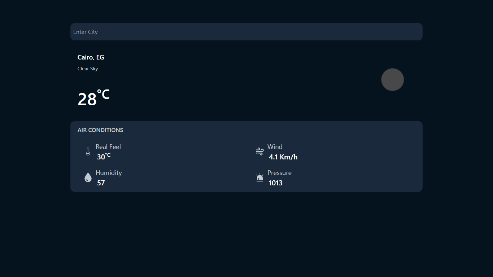

# Simple Weather app

<h3>First Task as a react developer at <a href="https://www.syncinterns.com/">Sync intern's</a></h3>

<h2><a href="https://simple-weather-bahaaghali000.onrender.com/">Live Demo</a></h2>

<h4>Technologies Used: </h4>
<ul>
    <li>React.js</li>
    <li>Tailwind CSS</li>
    <li>Vite</li>
    <li>Openweather Api</li>
</ul>
